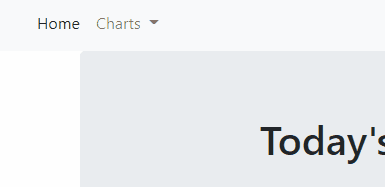
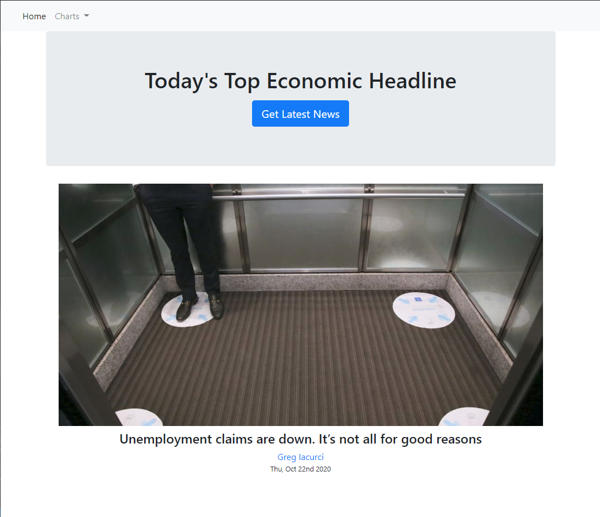
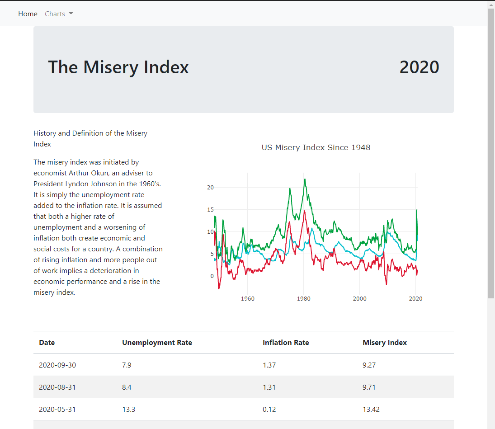
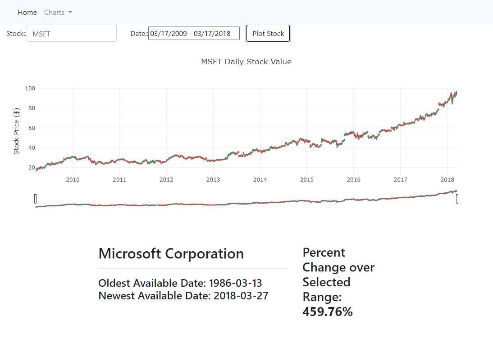
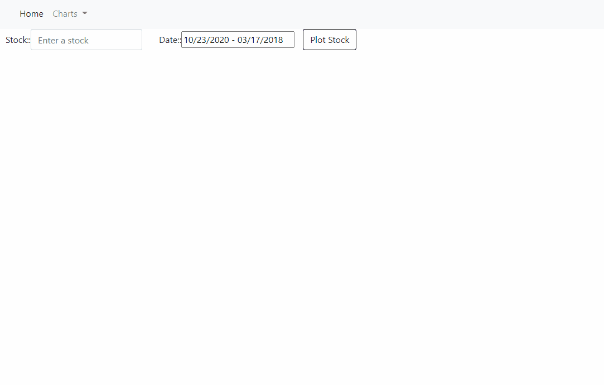

#Project_2

## OUTLINE: US Economic Dashboard- The State of the Economy

The goal of this project was to create visualizations of data. Our team chose to investigate the current state of the US economy and it's impact on US citizens. 
We created a website where you are able to select specific dates for stock prices and see comparisons of unemployment rate, inflation rate, and Misery Index. 

To view this please run the app.py in python terminal file to initiate the flask to your local server. For viewing the Misery index and using the stock search you will also need an api key form <a href="https://www.quandl.com/tools/api">quandl.com</a>. Then put your api key inside /static/js/config.js, you will need to make the config.js file and create a javascript variable "var API_KEY = "insert you api key from quandl";".

## Functionality and Backend:
•	An overall dashboard that will link to the various sites showing economic data and recent news.  In this website we focused on the Misery Index and a stock search / stock plot creation.

• Each page in the app has a navbar for navigating the application easily.
•	Flask is used to structure between the backend and the frontend website.

### Home Dashboard

•	The home page is web scraped information from the CNBC Economic website for the most recent economic headlines and news stories. This includes article headline, image, and author. 
• MongoDb is used to house the web scraping results as a local database.

### Misery Index

•	Plotly javascript library is used for visualizations for Misery index.
•	D3 library is used to access quandl api for <a href="https://www.quandl.com/data/USMISERY-United-States-Misery-Index/usage/quickstart/api">US Misery Index</a>.
•	Misery Index, for our purpose, is used to define how the people are feeling in the economy.

### Stock Search

•	Plotly javascript library is used for visualizations for stock search image.
•	To construct and use the calendar, dateragnepicker function from jquery library is utilized alongside moment.js.
•	D3 library is used to access quandl api for <a href="https://docs.quandl.com/docs/in-depth-usage">stock time series data</a>.
•	Stock search, for our purpose, is to show how those in Wall Street are feeling about the economy.

To use, input a ticker (abbreviation) for a stock and select a date range. The candlestick info for the stock price will then be displayed for the selected stock and date range. The stock company is displayed below the plot with the oldest and newest available dates from the api (free api, so data ends in 2018). Also displayed below the plot, the percent change in value of the stock will be displayed, defined by the range you select. View the gif below for examples.

Sources:
https://www.quandl.com/

https://www.cnbc.com/economy/

FILES USED:
index.html (MAIN WEB PAGE) misery.html stockSearch.html readme.md scrape_news.py app.py

STATIC: 
CSS: syle.css 
JS: plot.js plots js

